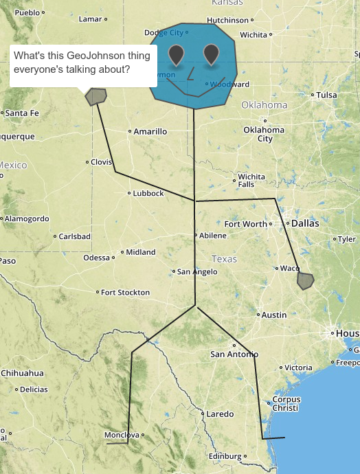
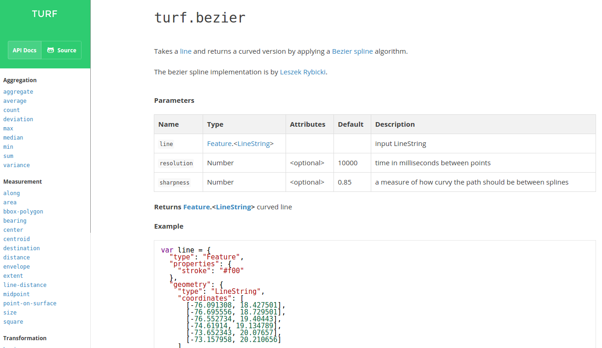
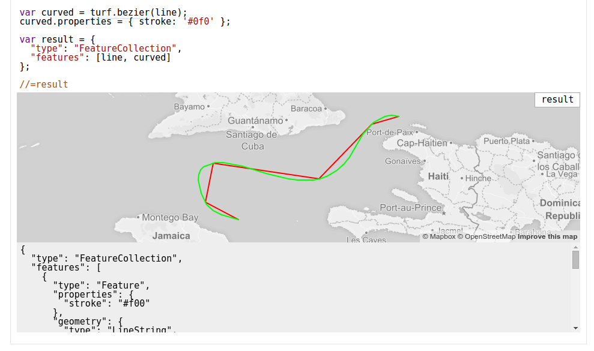

% Intro to Turf.js
% James Seppi
% TNRIS GeoRodeo - May 22, 2015

-------------------------------------------------

# Intro to Turf.js

Presentation by James Seppi

Software Developer at [TNRIS](http://tnris.org), part of [TWDB](http://www.twdb.texas.gov)

Twitter: [hydrologee](http://twitter.com/hydrologee)

Viewable at [http://jseppi.github.io/intro-to-turf/](http://jseppi.github.io/intro-to-turf/)

Source code at [https://github.com/jseppi/intro-to-turf/](https://github.com/jseppi/intro-to-turf/)


# What is Turf.js?

JavaScript library for geospatial analysis

. . .

Runs in the browser, or in [Node.js](http://nodejs.org)

. . .

Open Source, MIT-licensed

Collection of small modules

. . .

[turfjs.org](http://turfjs.org)

[github.com/turfjs](https://github.com/turfjs)


# Some History

(from Tom MacWright - [http://www.macwright.org/presentations/turf-geodc](http://www.macwright.org/presentations/turf-geodc))

. . .

2000: [Java Topology Suite (JTS)](http://tsusiatsoftware.net/jts/main.html)

. . .

2003: [GEOS](http://trac.osgeo.org/geos/), JTS port to C++

. . .

2008: [Shapely](http://toblerity.org/shapely/manual.html), interface of GEOS to Python

. . .

2011: [JavaScript Topology Suite (JSTS)](https://github.com/bjornharrtell/jsts), JTS port to JS

. . .

2014: [Turf](http://turfjs.org)

# About Turf.js

Not a port, new implementations

. . .

Project started and managed by [Morgan Herlocker](https://github.com/morganherlocker) (now at [Mapbox](http://mapbox.com))


. . .

1280+ stars, 15 owners


# Modules

Aggregation, Measurement, Transformation, Interpolation, Classification, Joins, Types, and Helpers

. . .

turf-area

. . .

turf-buffer

. . .

turf-distance

. . .

turf-intersect, turf-union, turf-merge

. . .

turf-aggregate, turf-along, turf-average, turf-bbox-polygon, turf-bearing, turf-bezier, turf-center, turf-centroid, turf-combine, turf-concave, turf-convex, turf-count, turf-destination, turf-deviation, turf-envelope, turf-erase, turf-explode, turf-extent, turf-featurecollection, turf-filter, turf-flip, turf-hex-grid, turf-inside, turf-isolines, turf-jenks, turf-kinks, turf-line-distance, turf-line-slice, turf-linestring, turf-max, turf-median, turf-midpoint, turf-min, turf-nearest, turf-planepoint, turf-point, turf-point-grid, turf-point-on-line, turf-point-on-surface, turf-polygon, turf-quantile, turf-random, turf-reclass, turf-remove, turf-sample, turf-simplify, turf-size, turf-square, turf-square-grid, turf-sum, turf-tag, turf-tin, turf-triangle-grid, turf-variance, turf-within


# Why does this matter?

New implementations, new algorithms - pretty fast!

. . .

"Isomorphic" - browser and back-end

. . .

Loosely coupled functionality

. . .

Modular - take only what you need (good for browser usage)

. . .

Speaks [GeoJSON](http://geojson.org)

. . .

# GeoJSON

Lingua franca for geospatial data on the web

. . .

Point, LineString, Polygon, MultiPoint, MultiLineString, MultiPolygon, GeometryCollection

. . .

Feature, FeatureCollection
(store properties with geometries)

# GeoJSON

```json
{
  "type": "Feature",
  "geometry": {
    "type": "Point",
    "coordinates": [125.6, 10.1]
  },
  "properties": {
    "name": "Dinagat Islands"
  }
}
```

[geojson.org](http://geojson.org)

[geojson.io](http://geojson.io)

GitHub renders it: [github.com/tnris/tx.geojson](https://github.com/tnris/tx.geojson)

# Not GeoJohnson



# Examples!

Word of Warning: Browser rendering performance

. . .

Nonetheless, it is fun to see in a web map

# Examples

Our basic FeatureCollection

```javascript
//tnris geojson made with rasterio
result = tnris;
```

<button class="button">Show Demo</button>

-----------------------------------------------------------

#TODO: buffer, union, intersection

-----------------------------------------------------------

```javascript
result = turf.explode(tnris);
display = 'Num Points: ' + result.features.length;
```

<button class="button">Show Demo</button>

-----------------------------------------------------------


```javascript
var merged = turf.merge(tnris);
var polys = merged.geometry.coordinates.map(function (c) {
  return turf.simplify(turf.polygon(c), 0.1, false);
});
result = turf.featurecollection(polys);
```

<button class="button">Show Demo</button>

-----------------------------------------------------------

```javascript
//use simplified result from previous example
result = turf.explode(result);
display = 'Num Points: ' + result.features.length;
```

<button class="button">Show Demo</button>

-----------------------------------------------------------

```javascript
//use exploded result from previous example
result = turf.tin(result);
```

<button class="button">Show Demo</button>

-----------------------------------------------------------

# Grids

```javascript
var bbox = turf.extent(tnris);
var grid = turf.squareGrid(bbox, 50, 'miles');
var points = turf.explode(tnris);
var counted = turf.count(grid, points, 'pointCount');
result = counted;
```

<button class="button">Show Demo</button>

-----------------------------------------------------------

```javascript
var bbox = turf.extent(tnris);
var grid = turf.triangleGrid(bbox, 50, 'miles');
var points = turf.explode(tnris);
var counted = turf.count(grid, points, 'pointCount');
result = counted;
```

<button class="button">Show Demo</button>

-----------------------------------------------------------

```javascript
var bbox = turf.extent(tnris);
var grid = turf.hexGrid(bbox, 50, 'miles');
var points = turf.explode(tnris);
var counted = turf.count(grid, points, 'pointCount');
result = counted;
```

<button class="button">Show Demo</button>

-----------------------------------------------------------

# Documentation!

Documentation has been at the forefront of development by the core team 

. . .

(especially: [morganherlocker](https://github.com/morganherlocker), [tmcw](https://github.com/tmcw), [lyzidiamond](https://github.com/lyzidiamond), [tchannel](https://github.com/tchannel))



-----------------------------------------------------------



-----------------------------------------------------------

# Visualizations, Tools

](img/hex_temp_jvrousseau.png)

# Visualizations, Tools

https://www.mapbox.com/blog/playback-the-iditarod-with-turf/

https://www.mapbox.com/blog/60-years-of-tornadoes-with-turf/

http://turfjs.party/ by [tchannel](https://github.com/frankrowe)

http://frankrowe.org/ugis/ by [frankrowe](https://github.com/frankrowe)


# Get Involved

Open-Source, developed in the open on GitHub: [github.com/turfjs](https://github.com/turfjs)

. . .

Still more work to be done, docs to improve, code to write

. . .

Check out the issues: [github.com/turfjs/turf/issues](https://github.com/turfjs/turf/issues) 
